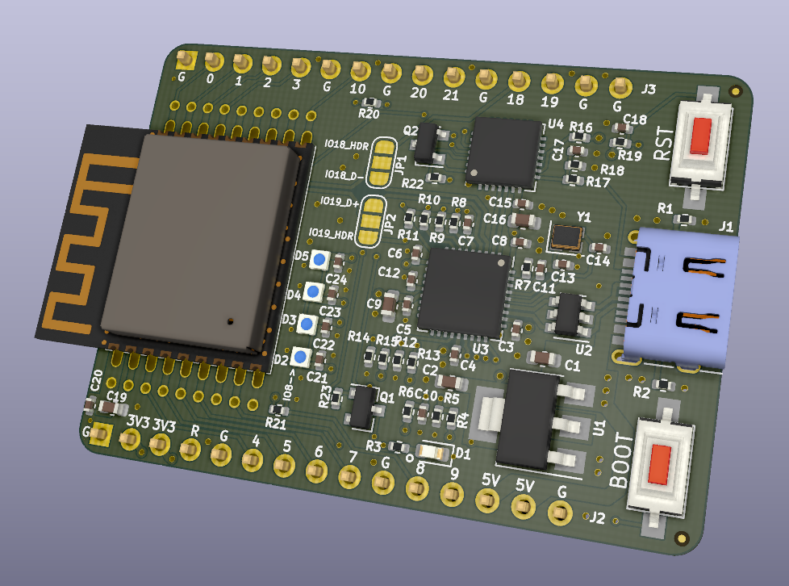
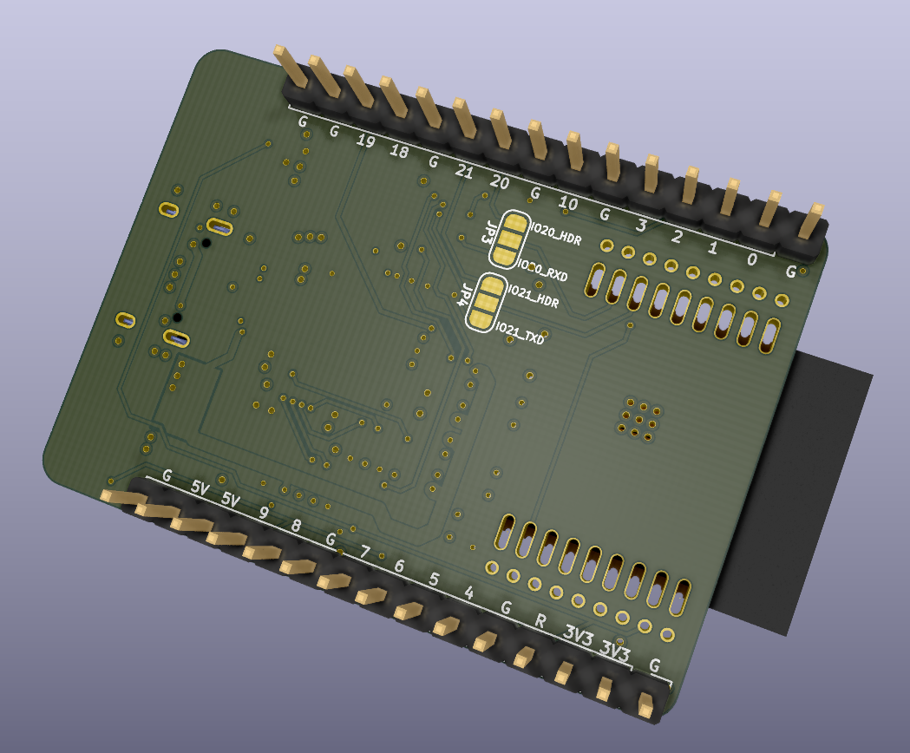

# ESP32-C3 Development board
A development board integrating the socket for easily swapping the ESP32-C3-WROOM-02 module.
It also includes:
* USB type C connector connected to USB hub (Microchip USB2514Bi) with these downstream ports:
  1. USB - UART adapter (Silabs CP2102N) connected to ESP32-C3 RXD and TXD pins - can be used for serial programming
  2. ESP32-C3 USB Serial/JTAG peripheral - can be used for serial programming and/or debugging the ESP32-C3
* ESD protection diodes on USB connector (SRV05-4)
* 4x SK6805 individually addressable LEDs connected to ESP32-C3's GPIO8 pin
* Pin headers compatible with ESP32-C3-DevkitC development kit by Espressif
* Solder bridges for disconnecting the USB - UART and USB hub from ESP32-C3's pins

## PCB front:

## PCB back:

## KiCAD version
This project is compatible with KiCAD version v6.
